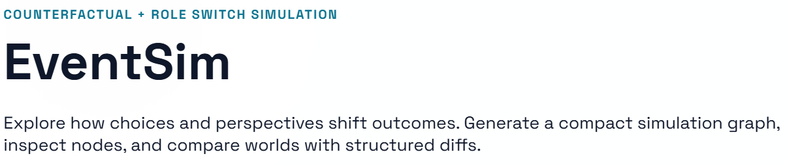

# EventSim



EventSim is an interactive decision-simulation tool. You enter one event, it generates multiple future branches, and helps you compare tradeoffs, risks, and likely outcomes.

## Quick Start

### 1. Install dependencies

From project root:

```bash
npm install
```

### 2. Configure environment files

Create backend env file from template:

```bash
copy backend\.env.example backend\.env
```

Frontend already points to local backend by default (`frontend/.env.example` uses `VITE_API_URL=http://localhost:8787`), so you usually do not need extra frontend config.

### 3. Run the app

Terminal 1 (backend):

```bash
npm run dev:backend
```

Terminal 2 (frontend):

```bash
npm run dev:frontend
```

Open:

- App: `http://localhost:5173`
- Health check: `http://localhost:8787/api/health`

## Core Capabilities

- Counterfactual branch generation (`minimal / moderate / radical`)
- Lazy node expansion (`consequences / why / risk / next question`)
- Double-click world nodes to branch further (configurable child count)
- Branch comparison (`Pros / Cons / Risks`) with exportable conclusion
- Multi-role chat (`You-Now`, `You-in-5-Years`, `Neutral Advisor`, `Custom Role`)
- Lineage timeline for explainable branch history
- Cache + fallback path for stable demos

## Typical User Flow

1. Start *EventSim*
2. Enter an event and generate the initial graph
3. Click a node to inspect details
4. Double-click a world node to create more branches
5. Select two branches and compare them
6. Use role chat to challenge assumptions
7. Use lineage view to present branch evolution

## Run Modes

### Mode A: Development mode (recommended)

Run backend and frontend separately for fast iteration:

```bash
npm run dev:backend
npm run dev:frontend
```

### Mode B: Single-port bundled mode

Backend serves built frontend assets from `frontend/dist`:

```bash
cd backend
npm run start:bundle
```

Open:

- `http://localhost:8787`

## Project Structure

```text
EventSim/
  backend/
    src/
    cache/
    demo/
    .env.example
  frontend/
    src/
    .env.example
  docs/
  assets/
```

## Reliability and Safety

- Rate limiting on key endpoints
- JSON cache for repeatable runs
- Restricted-content guardrails (medical/legal/self-harm categories)
- Provider fallback path when primary model calls fail

## Hackathon Compliance

### Team and Track

- Track: General Track
- Members: Yaqin Chen, Runlin Song, Xiayu Zhao
- Team size: 3

### Dataset and Data Science Use

- Dataset: FEMA disaster declarations ( https://www.kaggle.com/datasets/jgalin/disaster-declaration-summaries-19532022 )
- Processing script: `process_data.py`
- Methods used: feature selection, aggregation by state/incident type, IA/PA probability estimation, sparse-category filtering
- Output: `backend/data/fema_historical_insights.json` for RAG grounding

### Original Work and Build Ownership

- Core idea, implementation, and integration were completed by team members during the hackathon.
- External mentor input was limited to guidance/feedback, not implementation handoff.

### AI Tool Citation

- Codex
- Gemini
- GPT5.2
- Claude API

Used for coding assistance, prompt drafting, and documentation support. Final engineering validation and integration were completed by the team.

### Presentation and Judging

- The team will present the project for judging eligibility.
- The team acknowledges and accepts final judging outcomes.
